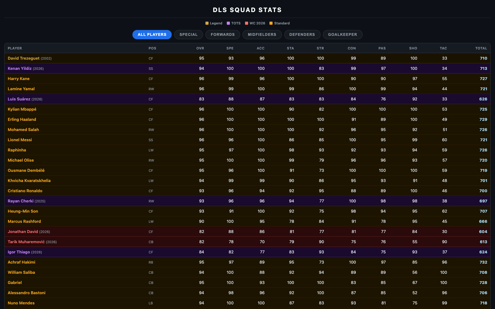
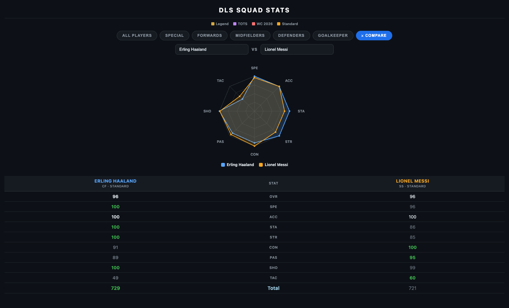

# DLS Squad Stats

A single-page, standalone stats reference table for **Dream League Soccer 2026** squads.

### ▶ Live site: **https://franciscozhou1010.github.io/dls-squad-stats/**

Open that link to see the actual product. Because the page is fully self-contained,
you can also just download **`index.html`** and double-click it to open in any
browser — it works offline, with no server and no internet connection needed.



## What's inside

- **73 players**, each rated across 9 attribute columns — `OVR`, `SPE`, `ACC`,
  `STA`, `STR`, `CON`, `PAS`, `SHO`, `TAC` — plus a **Total**.
- **Card types**, color-coded by row: 🟡 Legend · 🟣 TOTS · 🔴 WC 2026 · 🟠 Standard.
- **Category filters:** All Players · Special · Forwards · Midfielders · Defenders ·
  Goalkeeper, each with position sub-tabs (CF / LW / RW / SS, CM / AM / DM, CB / LB / RB).
- **Click any column header to sort** the table by that stat.
- **Live search** — start typing in the search box to instantly filter the list to
  players whose name matches.
- **Compare two players** — the **Compare** tab lets you pick any two players and
  see their stats side by side (the higher value in each row highlighted), plus an
  8-axis *octagram* radar that overlays both players' attributes for an at-a-glance
  shape comparison.
- **Goalkeepers** have their own table — shown beneath the outfield players on
  *All Players*, and on the *Goalkeeper* tab — with keeper-specific `GKR` / `GKH`
  columns in place of `STA` / `SHO`.
- **Best XI** — the **Best XI** tab auto-picks the top-rated player for each slot of a
  chosen formation (no player used twice) and lays them out on a pitch. Ships a
  4-3-3 (2 DM / 1 AM); more formations are a one-line addition to the `FORMATIONS` list.



## Tech

- One file: `index.html` — plain HTML, CSS, and vanilla JavaScript.
- **Single data source** — every player is defined once in a `PLAYERS` list near the
  bottom of the file; the page builds all tables, counts, search, and compare from it.
  Adding a player is a one-line change.
- **No external dependencies** — no CDN, no web fonts, no build step, no backend.
  All data, styling, and interactivity are inline, so it renders identically
  whether served online or opened straight from disk.

## View it locally

```bash
# Option 1 — just open the file
open index.html              # macOS (or simply double-click it)

# Option 2 — serve it over HTTP
python3 -m http.server 8000  # then visit http://localhost:8000
```

## Hosting

Deployed with **GitHub Pages** from the `main` branch root.
Every push to `main` redeploys the site automatically.
